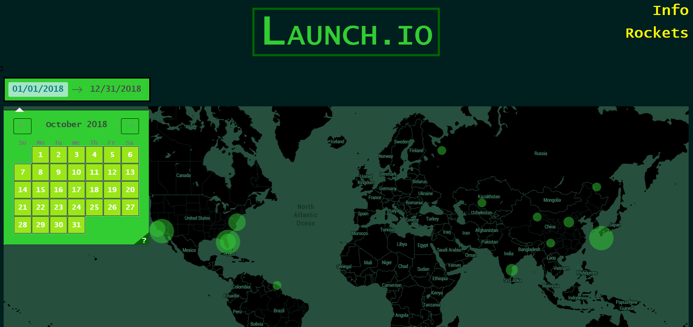
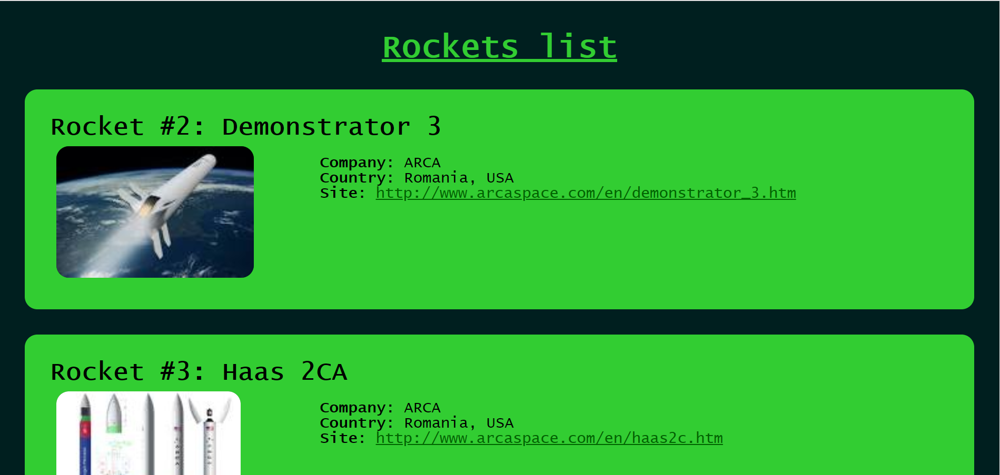

# Launch.io

An app our team made for NASA Space Apps Hackathon 2018.
It's supposed to run [here](https://launch-io.herokuapp.com/), but is currently unstable.
It's purpose is to provide accessible rocket launch information for everyone.

## Overview

At the top of main page user can get time of the next flight.

It is also possible to read information about a particular spaceport by clicking on it's marker on map. The bigger the circle the more launches will be done from this locatin. All data will be shown below the map.

Another feature is the ability to filter launches by time period, which can be chosen by picking two dates on the calendar. 

At the top right corner two links are located. The first one shows information about the reasons when and where a rocket will be launched and why a flight can be cancelled. 

The second one links to the list of active rockets and some useful description.

## References
The data about the rocket launches is being collected from [here](http://www.spaceflightinsider.com/launch-schedule/).

## Credits
[Lev Potomkin](https://github.com/lyova-potyomkin)

[Andrii Denysenko](https://github.com/ANDREYDEN)

Aleksandr Makarchuk

Eduard Laptiev
